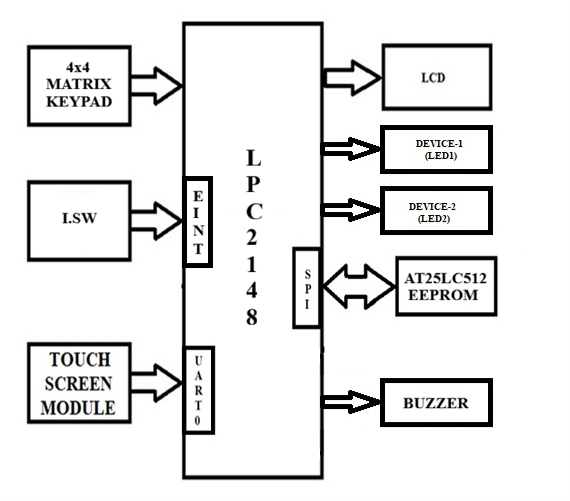

# Touch-Based Device Control System for Bedridden Patients

## Overview
- Enables bedridden patients to control electronic devices using a touch-based interface.
- Developed using the LPC2124 ARM7 Microcontroller.
- Provides secure access through password authentication.
- Stores user credentials in EEPROM via SPI communication.
- Allows device ON/OFF control through a touch screen.
- Displays system status and user instructions on an LCD.
- Supports password entry and modification using a keypad.
- Implements interrupt-based password update functionality.
- Demonstrates Embedded C programming, UART, SPI, EEPROM interfacing, and interrupt handling.
- Improves convenience, accessibility, and independence for physically challenged individuals.

## Block Diagram

  

## Project Images And Videos
https://drive.google.com/drive/folders/1QpSErZH3KshvxiU8Xgjd9GdowBaQYrSA?usp=drive_link

## Features
- Touch-based device control
- Password-protected access
- EEPROM-based password storage
- Password modification using external interrupt
- LCD display for user interaction
- Matrix keypad for password entry
- SPI communication with EEPROM
- UART communication support
- LED and buzzer control
- Interrupt-driven operation

## Hardware Requirements
- LPC2124 ARM7 Microcontroller
- Resistive Touch Screen
- 16x2 LCD Display
- 4x4 Matrix Keypad
- SPI EEPROM
- LEDs
- Buzzer
- Power Supply

## Software Requirements
- Embedded C
- Keil uVision
- Flash Magic
- Proteus (Optional for Simulation)

## Working Principle
1. User enters a valid password through the keypad.
2. Password is verified using EEPROM-stored credentials.
3. Upon successful authentication, the touch interface is enabled.
4. Users can control connected devices through predefined touch regions.
5. Password can be changed securely through an interrupt-based password update mechanism.
6. Updated passwords are stored permanently in EEPROM.

## Modules Used
- LCD Interface
- Keypad Interface
- Touch Screen Interface
- UART Communication
- SPI EEPROM Interface
- External Interrupts
- Device Control Module

## Applications
- Smart Hospital Rooms
- Patient Assistance Systems
- Home Automation
- Elderly Care Systems
- Assistive Healthcare Devices

## Future Enhancements
- Wireless device control
- IoT integration
- Mobile application support
- Voice-controlled operation
- Cloud-based monitoring

## Technologies Used
- Embedded C
- LPC2124 ARM7
- SPI Protocol
- UART Communication
- EEPROM Memory
- Interrupt Programming

## Project Outcomes

- Developed a **Touch-Based Device Control System** using Embedded C.
- Implemented **user input handling** through keypad/touch interface for device control.
- Added **secure password authentication** to prevent unauthorized access.
- Integrated **LCD display module** for real-time system messages and feedback.
- Enabled communication between multiple peripherals like **LCD, keypad, SPI, and interrupts**.
- Designed an **interrupt-driven system** to improve efficiency and responsiveness.
- Achieved modular code structure by separating functionalities into different `.c` and `.h` files.
- Ensured reliable input processing and accurate device control operations.
- Strengthened understanding of embedded system concepts such as **I/O interfacing, SPI communication, and interrupt handling**.
- Built a scalable foundation for applications like **home automation and smart control systems**.

---

## Conclusion
- Successfully developed a touch-based device control system using Embedded C.
- Ensures secure access through password authentication.
- Provides user-friendly device control with LCD feedback.
- Demonstrates SPI communication, EEPROM interfacing, and interrupt handling.
- Enhances accessibility and independence for bedridden patients.
- Suitable for future smart healthcare and home automation applications.
